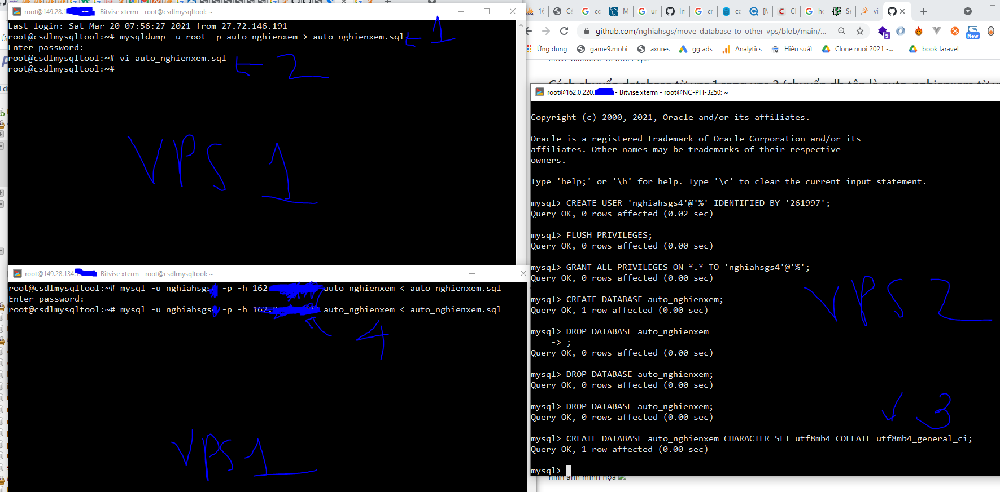

# move-database-to-other-vps
move database to other vps

## Cách chuyển database từ vps 1 sang vps 2 (chuyển db tên là auto_nghienxem từ vps 1 sang 2)

### Bước 1: (vps1) Export sql thành file sql sử dụng mysqldump
Ví dụ mình có db tên là auto_nghienxem, mình muốn export nó thành auto_nghienxem.sql
```
mysqldump -u root -p auto_nghienxem > auto_nghienxem.sql
```
Mở file vừa export, dùng vim để thay thế toàn bộ kiểu charset cho về utf8mb4_general_ci
Câu lệnh thay thế trong vim
```
:%s/utf8mb4_0900_ai_ci/utf8mb4_general_ci/g
```
```
:%s/CHARSET=utf8 /CHARSET=utf8mb4 /g
```
```
:%s/CHARACTER SET utf8/CHARACTER SET utf8mb4/g
```

### Bước 2: (vps2) Login vào vps và tạo database tên giống như tên bên vps 1
Tạo 1 user cho phép kết nối từ xa
```
http://nghiahsgs.com/cach-cai-dat-co-so-du-lieu-mysql-php-myadmin-tren-vps-ubuntu-server-va-cho-phep-ket-noi-mysql-tu-xa/
```
Ví dụ ở đây thì bên vps 2, mình sẽ tạo 1 db cũng tên là auto_nghienxem với charset sẽ là utf8mb4_general_ci
```
CREATE DATABASE auto_nghienxem CHARACTER SET utf8mb4 COLLATE utf8mb4_general_ci;
```
### Bước 3: (vps1)
Chạy câu lệnh import file sql vào db auto_nghienxem
```
mysql -u nghiahsgs -p -h ip_vps2 auto_nghienxem < auto_nghienxem.sql
```


hình ảnh minh họa

